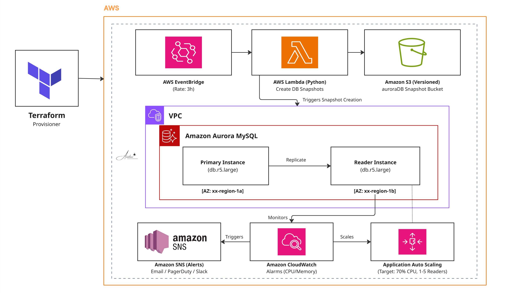

# Project # 24 - aurora-mysql-platform-terraform

Terraform module that provisions a multi-AZ Amazon Aurora MySQL cluster with read-replica autoscaling, CloudWatch alarms wired to SNS, and a scheduled Lambda snapshot pipeline that exports cluster snapshots to a versioned S3 bucket every three hours. Basically it provisions a highly available Aurora MySQL cluster with auto-scaling read replicas, integrated SNS alerting, and a serverless, automated snapshot pipeline for disaster recovery.

## Architecture


The cluster lives inside an existing VPC. A dedicated security group (`aurora-sg`) and DB subnet group bind it to two private subnets across separate AZs. The Lambda snapshot role has scoped IAM permissions: `rds:CreateDBSnapshot`, `rds:DescribeDBSnapshots`, `rds:StartExportTask`, and `s3:PutObject` against the snapshot bucket only.

## What It Provisions

- Aurora MySQL cluster (engine `5.7.mysql_aurora.2.11.5`) with two `db.r5.large` instances split across two AZs
- DB subnet group spanning two private subnets, dedicated security group
- Application Auto Scaling target on `RDSReaderAverageCPUUtilization` (target 70%, min 1, max 5, 5-minute cooldowns)
- CloudWatch alarms for CPU and freeable memory, both publishing to a shared SNS topic
- S3 bucket (versioned, 150-day lifecycle) for snapshot metadata
- Lambda function (Python 3.9, 10-minute timeout) that creates cluster snapshots and writes metadata JSON to S3
- EventBridge rule (`rate(3 hours)`) invoking the snapshot Lambda

## Stack

Terraform 1.3+ · AWS provider ~> 5.0 · RDS Aurora MySQL · Application Auto Scaling · CloudWatch · EventBridge · Lambda (Python 3.9) · S3 · SNS · IAM

## How It Works

1. `terraform apply` provisions the cluster, autoscaling, alarms, snapshot bucket, snapshot Lambda, and the EventBridge schedule.
2. Every 3 hours, EventBridge invokes the Lambda. The handler calls `create_db_cluster_snapshot`, waits on `db_cluster_snapshot_available`, then writes snapshot metadata JSON to `s3://<bucket>/snapshots/<cluster-id>-snapshot-<timestamp>.json`.
3. CloudWatch alarms publish to SNS when CPU reaches 80% or freeable memory drops to 1 GB. SNS subscriptions (email, Slack, PagerDuty) are configured separately.

## Prerequisites

- Terraform >= 1.3
- AWS CLI configured
- An existing VPC with at least two private subnets in different AZs
- AWS credentials with permissions for: `rds:*`, `application-autoscaling:*`, `iam:CreateRole/CreatePolicy/AttachRolePolicy`, `lambda:*`, `events:*`, `s3:*`, `cloudwatch:PutMetricAlarm`, `sns:CreateTopic`, `ec2:*SecurityGroup*`, `ec2:*Subnet*`
- Populate `config/terraform.tfvars` from the `.example` template before applying

## Deployment

```bash
terraform init
terraform plan
terraform apply
```

## Teardown

The S3 snapshot bucket is versioned and must be emptied (including all object versions) before destroy:

```bash
aws s3api delete-objects --bucket <bucket> \
  --delete "$(aws s3api list-object-versions --bucket <bucket> \
    --query '{Objects: Versions[].{Key:Key,VersionId:VersionId}}')"

terraform destroy
```

## Notes

- Aurora MySQL 5.7 (`2.11.x` family) reached end of standard support in October 2024. New deployments should target Aurora MySQL 8.0; this module's engine version was pinned for compatibility with an existing application.
- The Lambda is packaged from `lambda_function.zip`. Rebuild from `lambda_function.py` before applying if the source has changed.
- The Nginx bootstrap script (`scripts/nginx-bootstrap.sh`) is applied to the web tier outside this Terraform module. It registers the EC2 private IP as an Nginx `server_name` and installs `/health` and `/elb-status` probe endpoints.
- All configuration is parameterised via `variables.tf` and `terraform.tfvars`. No hardcoded values are tracked.
